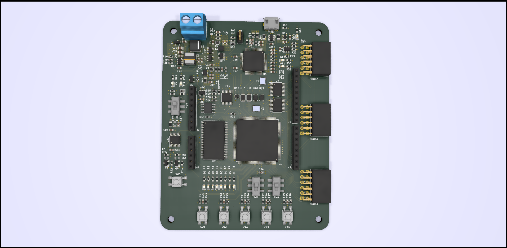

# A ICE40HX4k Breakout for educational purposes

The basic idea behind this project is to create a simple breakout of an ICE40 FPGA with some LEDs and Buttons to interact with the FPGA and enough resources to run a simple softcore, like a small RISC-V core. Therefore a SRAM will be added in case the internal memory blocks are not big enough, The configuration SPI flash may be used to store programm data for the softcore. So this board can be used for teaching basic FPGA, microcontroller and CPU architecture topics.
